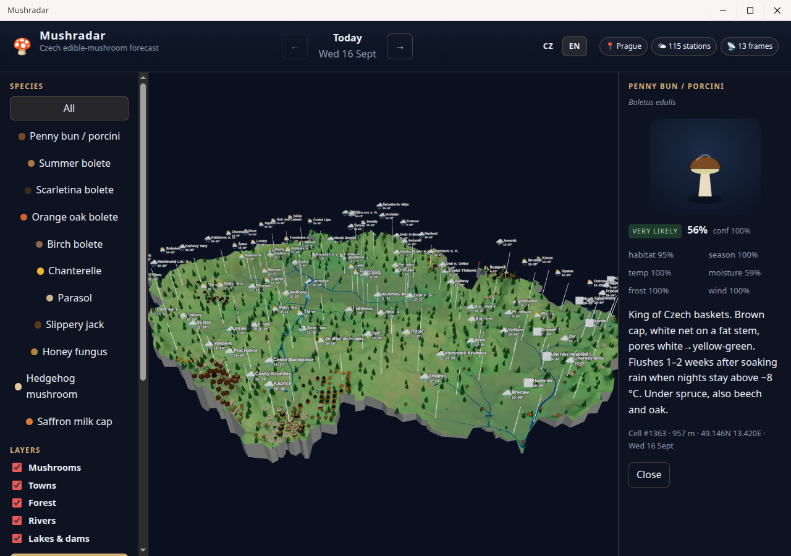

# 🍄 Mushradar (alpha)

**Where to find edible mushrooms in the Czech Republic — today and 14 days
ahead.** A 3D map of the country scores every forest cell for 11 species from
forest type, altitude, season and the past 3 weeks of weather plus the forecast.



## ✨ Features

- 🗺️ 3D terrain with forests, rivers, lakes and 100+ towns showing live weather
- 🍄 11 species (porcini, chanterelle, parasol…), hotspots sized by score
- 📅 Day picker (`←` `→`): today + 14 days, confidence falls with distance
- 🔎 Click a mushroom → score, the 6 factors behind it, and an illustration
- 📍 Your location from your IP address · 🇨🇿/🇬🇧 Czech and English UI
- 🌦️ Weather: [Open-Meteo](https://open-meteo.com) · 📡 radar:
  [RainViewer](https://www.rainviewer.com) · no API keys

## 🚀 Run

Needs [Deno](https://deno.com) ≥ 2.9 and [aio](https://github.com/riagentic/aio)
(`am`). After cloning, run `am fix` once.

```sh
deno task dev            # desktop app (Electron); --client=browser for a tab
deno task test           # tests · deno task check · deno task lint
deno task build          # dist/: AppImage + browser binary
```

## 🧠 How it works

| Part     | Where                                                                     |
| -------- | ------------------------------------------------------------------------- |
| Model    | `src/model/predict.ts`: habitat × season × temp × moisture × frost × wind |
| Weather  | `src/cell/weather.ts`: refetches when data is 3 h old (quota-safe)        |
| Map + UI | `src/ui/Map3D.tsx` (Three.js) · `src/App.tsx`                             |
| Data     | `src/data/`: terrain + forest grid, species, towns, rivers, lakes         |

> ⚠️ A forecast, not a guarantee. Only pick mushrooms you know for sure.

## 📜 License

[MIT](LICENSE). Data: weather and elevation ©
[Open-Meteo](https://open-meteo.com) (CC BY 4.0) · radar ©
[RainViewer](https://www.rainviewer.com) · tree cover ©
Hansen/UMD/Google/USGS/NASA via
[Global Forest Watch](https://www.globalforestwatch.org) (CC BY 4.0) · border ©
[OpenStreetMap](https://www.openstreetmap.org/copyright) contributors (ODbL) ·
IP location by [ip-api.com](https://ip-api.com) (free for non-commercial use).
